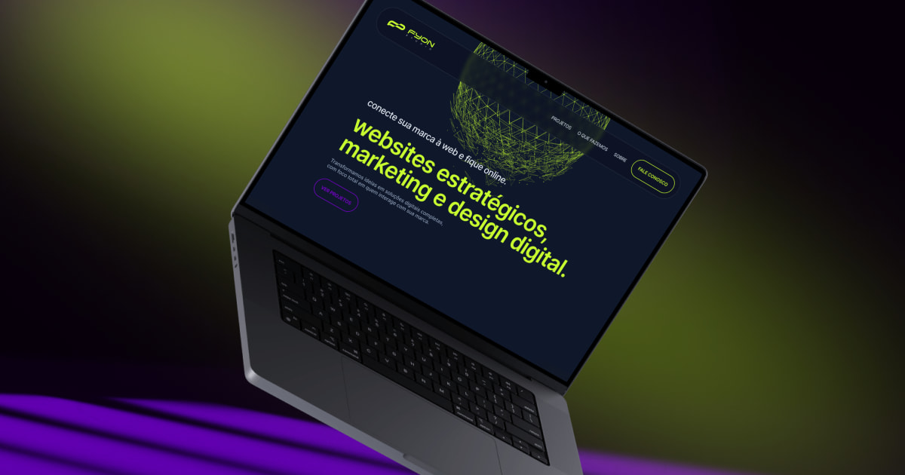

<div align="center">


 


</div>

<h1 align="center">Website Responsivo FyOn Studio</h1>

---

### 🧭 Navegação Rápida

- 📝 [Sobre](#-sobre)
- 🚀 [UI e Deploy](#-ui-e-deploy)
- 🧩 [Principais Dependências](#-principais-dependências)
- 📋 [Clone do Repositório](#-clone-do-repositório)
- 🤝 [Contribuições](#-contribuições)

---

### 📝 Sobre
Website institucional desenvolvido para o **Fyon Studio**, com foco em oferecer serviços de **web design estratégico**, **marketing digital** e **UI Design**. O projeto foi construído priorizando **performance**, **acessibilidade** e uma **experiência fluida** para o usuário final.

O layout é totalmente **responsivo**, garantindo ótima usabilidade em **desktop**, **tablet** e **dispositivos móveis**.

---

### 🚀 UI e Deploy
<div align="center">
<p >
  
</p>

[→ Ver Projeto On-line 🔗](https://fyonstudio.com.br)

</div>

---
### 🧩 Principais Dependências

Este projeto foi construído com foco em produtividade, responsividade e boas práticas de estilização. As principais dependências utilizadas são:


- **[Tailwind CLI](https://tailwindcss.com/docs/installation/tailwind-cli)** – Para geração do CSS final a partir dos templates.
- **[PostCSS](https://postcss.org/)** e **[Autoprefixer](https://github.com/postcss/autoprefixer)** – Utilizados no processo de build dos estilos.
- **[Iconify para Tailwind](https://iconify.design/docs/usage/css/tailwind/tailwind4/)** – Para integração de ícones SVG com classes do Tailwind.
- **[Prettier](https://github.com/tailwindlabs/prettier-plugin-tailwindcss)** com **prettier-plugin-tailwindcss** – Padronização e ordenação automática das classes CSS.

Para a lista completa de dependências e versões, consulte o arquivo [`package.json`](./package.json).

---

### 📋 Clone do Repositório:

Abra o **VS Code**, pressione `Ctrl + Shift + P`, digite **"Git Clone"** e cole o link do repositório:
```sh
https://github.com/domfabio/Website-FyOn-Studio.git
```

---

### 🤝 Contribuições

Contribuições são bem-vindas! Sinta-se à vontade para abrir *issues*, enviar *pull requests* ou sugerir melhorias.  
Este projeto está sob a licença **CC BY-NC 4.0**, o que significa que **não pode ser utilizado para fins comerciais**.  
Consulte o arquivo [`LICENSE`](./LICENSE) para mais informações.

---

> Desenvolvido por [@domfabio](https://github.com/domfabio) e [FyOn Studio](https://fyonstudio.com.br)✨